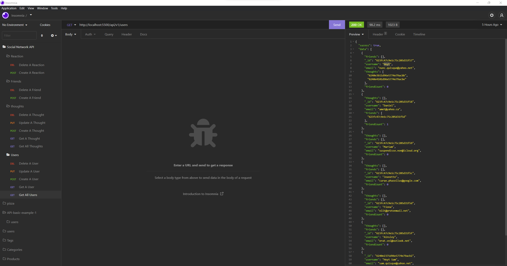
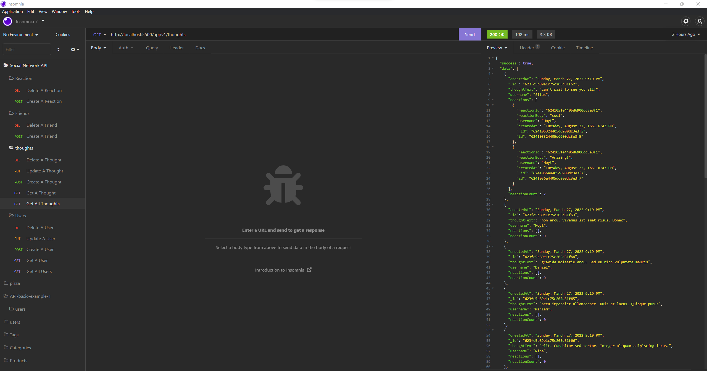
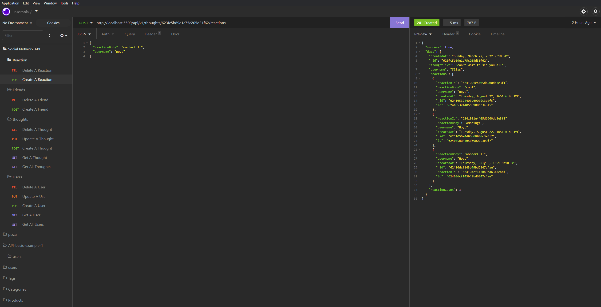
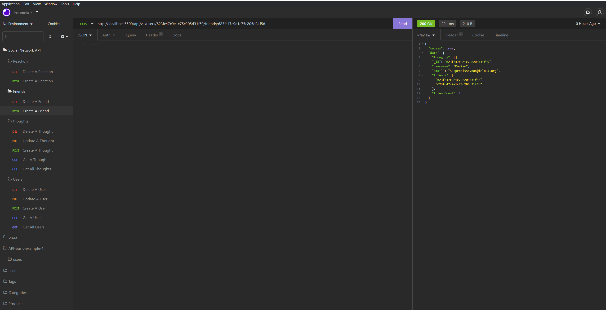
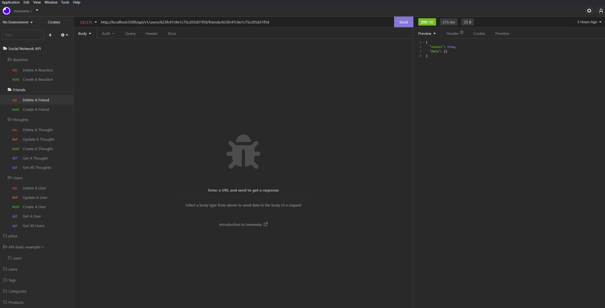

# NoSQL-Social Network API

This is a social network API, using Express.js for routing, a MongoDB database, and the Mongoose ODM. In addition to using the Express and Mongoose packages, you may also optionally use a JavaScript date library of your choice or the native JavaScript Date object to format timestamps.


## User Story

```
AS A social media startup
I WANT an API for my social network that uses a NoSQL database
SO THAT my website can handle large amounts of unstructured data
```

## Acceptance Criteria

```
GIVEN a social network API
WHEN I enter the command to invoke the application
THEN my server is started and the Mongoose models are synced to the MongoDB database
WHEN I open API GET routes in Insomnia for users and thoughts
THEN the data for each of these routes is displayed in a formatted JSON
WHEN I test API POST, PUT, and DELETE routes in Insomnia
THEN I am able to successfully create, update, and delete users and thoughts in my database
WHEN I test API POST and DELETE routes in Insomnia
THEN I am able to successfully create and delete reactions to thoughts and add and remove friends to a user’s friend list
```

## Screenshots

<pre></pre>
<pre></pre>
<pre></pre>
<pre></pre>
<pre></pre>


## Video Demonstration

[Video Demo1](https://drive.google.com/file/d/1Cx0Bc5US0kdfw-mE7h6Y10gWacpUNEWN/view?usp=sharing)

[Video Demo2](https://drive.google.com/file/d/1K9JwFDgIAaUtktYPQoADxYZ84_hOZ2Fm/view?usp=sharing)

[Video Demo3](https://drive.google.com/file/d/1dzkDOPXSovKPdkCWfC0pQlE7cH1Jmxur/view?usp=sharing)


## Contact
[GitHub](https://github.com/Abi-2021)  

